<div align="center">

# Junyeong Song

[](https://github.com/jjuunnii98)

<br>

> Financial distress models have not fundamentally changed since Altman (1968).  
> Static scoring. No censoring. No time structure. Fifty years of the same assumption.  
> I'm building the next layer — survival-based, market-aware, production-ready.

<br>

[](https://www.linkedin.com/in/jun-yeong-song/)
[](https://junixion.com)
[](https://huggingface.co/JUNIXION)
[](mailto:jjuunnii98@yonsei.ac.kr)


<br>



<br>

<picture>
  <source media="(prefers-color-scheme: dark)" srcset="https://raw.githubusercontent.com/jjuunnii98/jjuunnii98/output/github-snake-dark.svg" />
  <source media="(prefers-color-scheme: light)" srcset="https://raw.githubusercontent.com/jjuunnii98/jjuunnii98/output/github-snake.svg" />
  
</picture>

</div>

---

## Research

### Survival Analysis of Corporate Delisting Risk in the Korean Stock Market
**Cox Proportional Hazards and Accelerated Failure Time Models — KOSPI/KOSDAQ Panel Data (2000–2023)**

📄 [SSRN Working Paper](https://papers.ssrn.com/abstract=6656258) · Submitted April 2026

> *Static scoring models (Altman Z-score, logistic regression) treat failure as a binary outcome and discard censored observations. This paper replaces that assumption with event-history methodology — and it works.*

**What this paper does**
- Constructs a KRX survival dataset: 365 firms, 158 delisting events, 276-month observation window (DART + FinanceDataReader)
- Estimates and compares Kaplan-Meier, Cox PH, Weibull/Log-Normal/Log-Logistic AFT models
- Introduces heteroscedastic AFT extension — captures market-segment variance structure that standard Cox PH ignores

**Key findings**

| Finding | Result |
|---|---|
| Model discrimination | **C-index = 0.738** — competitive with Shumway (2001) US benchmark (C ≈ 0.74) |
| Dominant predictor | 12-month momentum: HR = 0.496, p = 0.001 — markets price distress before accounting statements do |
| Volatility signal | Price volatility: HR = 1.827, p = 0.004 — 82.7% higher delisting hazard per unit increase |
| Best specification | Weibull AFT (ancillary scale): AIC = 1620.6 — ΔAIC = 318.1 over homoscedastic (p < 0.001) |
| Market heterogeneity | KOSDAQ vs. KOSPI log-rank χ² = 10.57, p = 0.001 — fundamentally different survival distributions |

`survival analysis` `Cox PH` `AFT` `financial distress` `KRX` `KOSPI` `KOSDAQ` `DART` `empirical finance`

---

## Projects

**[Survival Analysis — Finance](https://github.com/jjuunnii98/survival-analysis-finance)**  
Full implementation of the research above. Cox PH, Weibull/Log-Normal/Log-Logistic AFT, heteroscedastic extension, Kaplan-Meier curves, Schoenfeld residual diagnostics. Reproduces all tables and figures in the working paper.  


**[Crypto Risk Scoring Demo](https://github.com/jjuunnii98/crypto-risk-scoring-demo)**  
End-to-end crypto market risk scoring pipeline: real-time data ingestion, feature engineering, multi-signal quantitative risk scoring, and FastAPI deployment.  


**[End-to-End ML Analytics System](https://github.com/jjuunnii98/end-to-end-ml-analytics-system)**  
Full ML lifecycle from raw data to Dockerized API serving. Production-oriented architecture: preprocessing → training → evaluation → inference endpoint.  


**[SQL Analytics Portfolio](https://github.com/jjuunnii98/sql-analytics-portfolio)**  
Financial and crypto data analysis with SQL: window functions, time-series aggregation, market data queries.  


**[Graduate ML Portfolio](https://github.com/jjuunnii98/grad-portfolio-ml)**  
Penalized Cox regression, statistical modeling experiments, and replication studies from undergraduate research.  


**[Python Analysis Lab](https://github.com/jjuunnii98/python-analysis-lab)**  
Structured EDA, statistical modeling, and reproducible analysis workflows.  


---

## Stack

<div align="center">

**Languages & Modeling**


**ML / Statistical Modeling**


**Backend / Deployment**


**Analytics & Visualization**


</div>

---

## JUNIXION

**[junixion.com](https://junixion.com)** — Risk Intelligence AI · FinTech

The research above is not an academic exercise. It is the proof of concept for a broader system.

Financial risk intelligence does not exist as a dedicated AI platform. Bloomberg gives you data. ChatGPT gives you text. Neither gives you a principled, real-time, censoring-aware risk score grounded in the actual statistical structure of financial failure.

That is what JUNIXION builds.

```
Research layer   →  Survival models, stochastic processes, quantitative risk theory
Engineering layer →  Real-time inference, scalable pipelines, production deployment
Product layer    →  Domain-specialized Risk Intelligence AI for financial decision-making
```

Proprietary system architecture. IP filing in preparation.

---

## Roadmap

```
2026.08 ──▶  Graduation · Yonsei University
2026    ──▶  Technology IP Filing · JUNIXION proprietary system
2026    ──▶  JUNIXION FinTech company launch preparation
2027.03 ──▶  Graduate School · Financial Engineering / AI (Spring entry)
```

---

## Background

**Yonsei University** — Economics × Information Statistics · Expected August 2026  
Undergraduate Research Assistant — Survival Analysis & Healthcare Risk Modeling  
Founder — JUNIXION (Risk Intelligence AI · FinTech Startup)

### Certifications

**Completed**
- ADsP · SQLD · CDS 빅데이터 전문가 과정
- 2024 제주 스마트관광 빅데이터 해커톤 우수상 — Team Leader

**In Progress**
- 투자자산운용사 (Investment Asset Manager)
- 빅데이터분석기사 (Big Data Analytics Engineer) · 정보처리기사 (Engineer Information Processing)

**Planned**
- 리눅스마스터 1급 (Linux Master Level 1) · 정보보안기사 (Engineer Information Security)
- 금융투자분석사 (Financial Investment Analyst)

---

<div align="center">

[](https://www.linkedin.com/in/jun-yeong-song/)
[](https://junixion.com)
[](mailto:jjuunnii98@yonsei.ac.kr)

</div>
